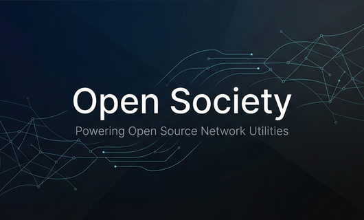

# Open Society 👋
### *Powering Open Source Network Utilities*

---

### 🛡️ About Us
Welcome to **Open Society**, a community-driven organization dedicated to building powerful, cross-platform network tools and utilities. Our mission is to provide developers and users with accessible, high-performance tools for network analysis, monitoring, and security.

### 🚀 Featured Projects

| Project | Description | Badges |
| :--- | :--- | :--- |
| **[Vernet](https://github.com/osociety/vernet)** | A full-featured Network Analyzer and Monitoring Tool for Android, iOS, macOS, Windows, and Linux. |  |
| **[Network Tools](https://github.com/osociety/network_tools)** | Cross-platform Dart/Flutter library for host scanning, port scanning, and mdns discovery. |  |
| **[Network Tools Flutter](https://github.com/osociety/network_tools_flutter)** | Flutter specific features for network_tools, handling platform limitations and mDNS. |  |

---

### 💞 Support & Donate
Maintaining these tools takes time and resources. If you find our work useful, please consider supporting us:

1. **Star our repositories**: It helps more than you think!
2. **Contribute**: We love PRs and bug reports.
3. **Financial Support**:

| **Platform** | **Link** |
| :--- | :--- |
| **Librepay** |  |
| **Ko-Fi** |  |

---

  

